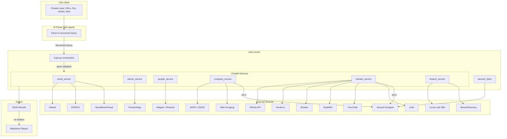
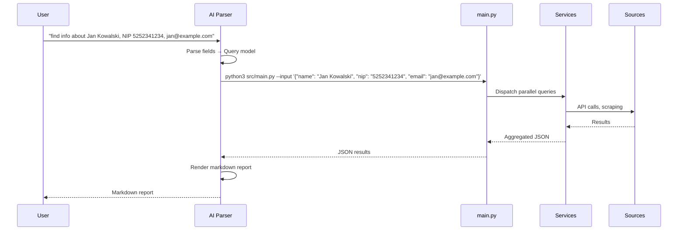
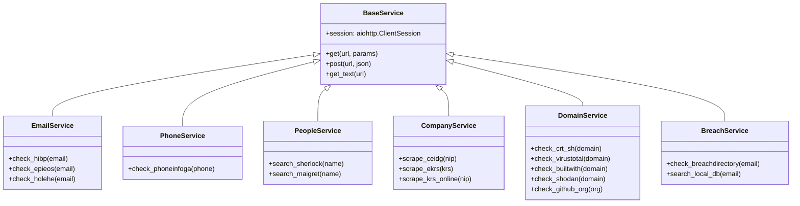
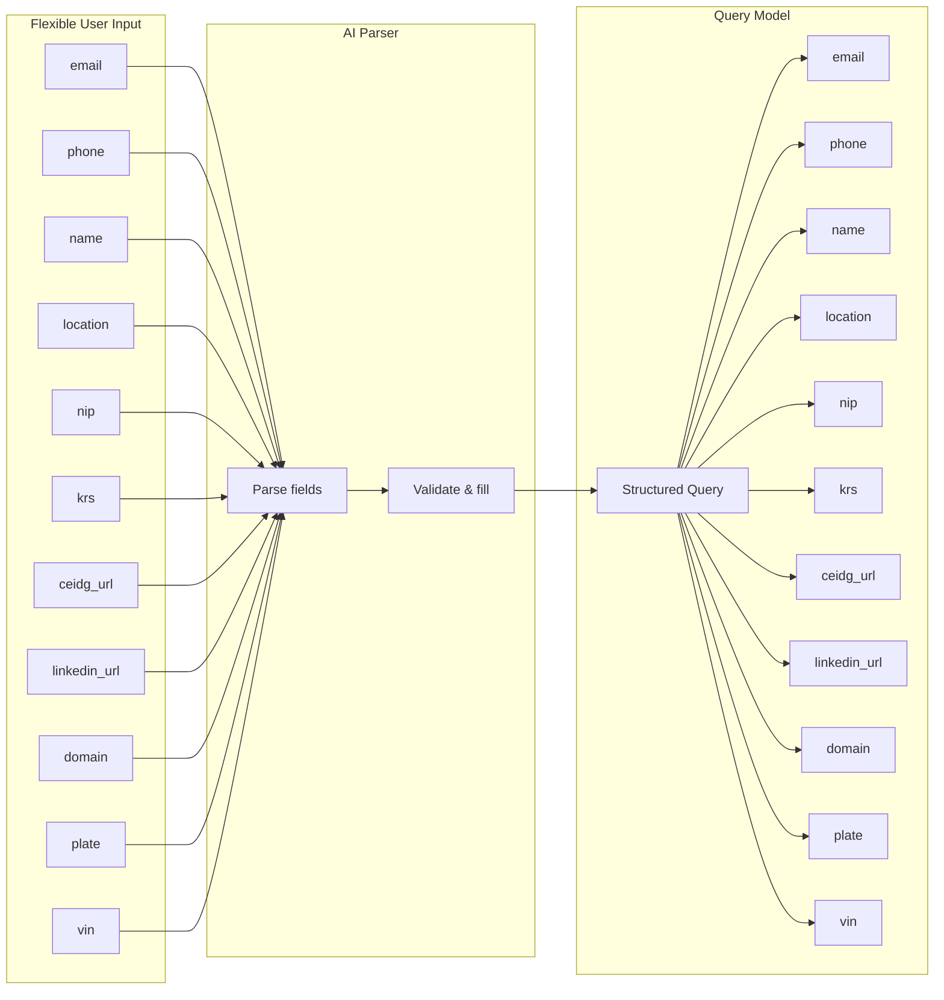
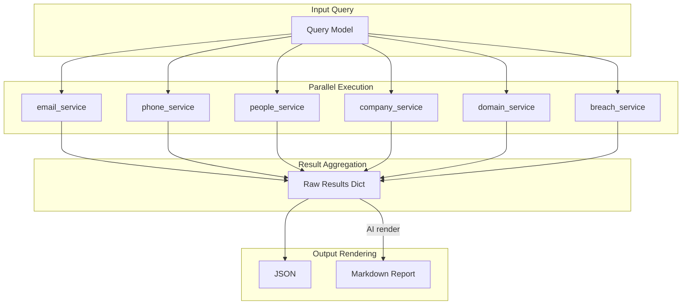
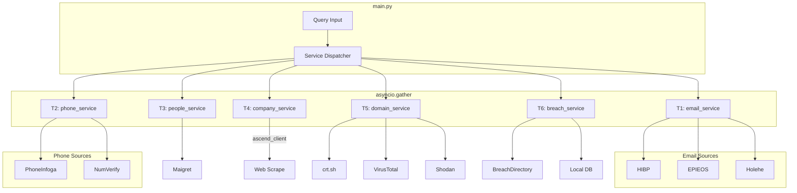

# Architecture

## System Overview



## Query Flow



## Service Architecture



## Input → Query Model



## Data Flow



## Source Categories

```
┌─────────────────────────────────────────────────────────────┐
│                     SOURCE CATEGORIES                       │
├──────────────┬──────────────┬───────────────┬───────────────┤
│   Email      │   Phone      │   People      │   Company     │
│              │              │               │               │
│ HIBP         │ PhoneInfoga  │ Maigret       │ eKRS          │
│ EPIEOS       │ Truecaller   │ Sherlock      │ CEIDG         │
│ Holehe       │ NumVerify    │ Pipl          │ KRS-online    │
│ Hunter.io    │ OSINT Ind.   │ Spokeo        │ Rejestr.io    │
│ Clearbit     │              │ BeenVerified  │ e-Sąd         │
│ FullContact  │              │ Instant CM    │ iMSiG         │
├──────────────┼──────────────┼───────────────┼───────────────┤
│   Domain     │   Breach     │   Code        │   Geo         │
│              │              │               │               │
│ crt.sh       │ BreachDir.   │ GitHub        │ Google Maps   │
│ VirusTotal   │ LeakCheck    │ GitLab        │ Sentinel Hub  │
│ BuiltWith    │ DeHashed     │ DockerHub     │ Mapillary     │
│ Shodan       │ Snusbase     │ npm           │ Overpass TM   │
│ SecurityTr.  │ IntelX       │ PyPI          │ Wigle.net     │
│ Censys       │ GhostProject │ Bitbucket     │ FlightRadar   │
│ Hunter.io    │ Local DBs    │ Thingiverse   │ MarineTraffic │
├──────────────┴──────────────┴───────────────┴───────────────┤
│                     Polish Specific                         │
│                                                              │
│ eKRS, CEIDG, eKW, REGON, GUS, CEPiK, KRD, BIG, SUDOP, KIO,  │
│ e-Zamówienia, TERYT, NASK WHOIS, Biała Lista VAT           │
└─────────────────────────────────────────────────────────────┘
```

## CLI Interface

```mermaid
flowchart LR
    subgraph CLI["CLI Usage"]
        CMD1[python3 src/main.py --query "email@example.com"]
        CMD2[python3 src/main.py --query "5252341234" --type nip]
        CMD3[python3 src/main.py --query "Jan Kowalski" --type person --location Warsaw]
        CMD4[python3 src/main.py --query "https://linkedin.com/in/jankowski" --type linkedin]
        CMD5[python3 src/main.py --input '{"email": "x", "nip": "y"}']
    end
```

## Async Parallel Execution


